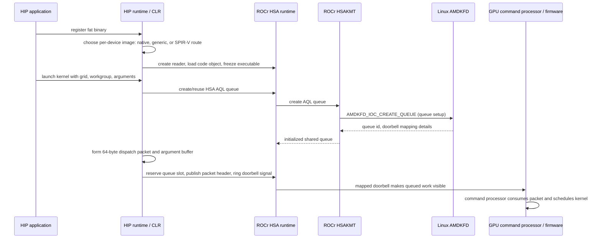

# AMDGPU HIP/HSA dispatch: source trace

## 질문과 범위

이 기록은 AMDGPU GFX/HSA compute 경로에서 다음 관계를 소스 코드로 확인한다.

1. 애플리케이션에 들어 있는 device image 중 어떤 이미지를 고르는가?
2. code object를 실행 가능한 HSA executable로 어떻게 로드하는가?
3. HSA queue는 어디서 만들어지고 Linux KFD까지 어떤 정보가 내려가는가?
4. kernel dispatch packet은 누가 쓰고, GPU에 어떻게 알려주는가?

이것은 실행 trace가 아니라 소스 trace다. Linux/macOS 연구 호스트에는 ROCm GPU가 없어서 ioctl 호출이나 GPU 실행을 관찰하지 않았다. 외부 소스의 다음 snapshot을 고정해 조사했다.

| 저장소 | 조사한 commit | 날짜 |
|---|---|---|
| [ROCm/clr](https://github.com/ROCm/clr/tree/3b6b838f62f0730f194ff0aab703a6ff02dddc04) | `3b6b838f62f0730f194ff0aab703a6ff02dddc04` | 2026-09-29 |
| [ROCm/rocm-systems](https://github.com/ROCm/rocm-systems/tree/7a400ac5b2d6d669c2b758368478ec10baeaff7b) | `7a400ac5b2d6d669c2b758368478ec10baeaff7b` | 2026-09-29 |
| [torvalds/linux](https://github.com/torvalds/linux/tree/551c722f40809618230001baccf219193e22fc5a) | `551c722f40809618230001baccf219193e22fc5a` | 2026-09-29 |

## 소스에서 이어지는 경로

The sequence shows ownership boundaries, not a promise that each HIP call maps to exactly one function or ioctl. Queue creation can be lazy, queues are pooled/reused, and graph capture can defer packet submission.

### 1. Fat binary registration and target selection

`__hipRegisterFatBinary` distinguishes ordinary HIPF wrappers from HIPK/kpack metadata and sends the normal path to `StatCO::AddFatBinary`. Once HIP is initialized, `AddFatBinary` digests the image through `FatBinaryInfo::ExtractFatBinaryUsingCOMGR`.

The extractor accepts a direct AMDGPU ELF code object or unpacks a fat image. In the default path it tries the exact native target, then its generic target; if neither is selected and SPIR-V is present, it asks COMGR to relocate/compile that route for the device target. `HIP_FORCE_SPIRV_CODEOBJECT` can force the SPIR-V route when that image is present. This is an important boundary: a code object can already contain native instructions, or it can carry a virtual representation that triggers a translation path.

- [`hip_platform.cpp`: `__hipRegisterFatBinary`](https://github.com/ROCm/clr/blob/3b6b838f62f0730f194ff0aab703a6ff02dddc04/hipamd/src/hip_platform.cpp#L180-L205)
- [`hip_code_object.cpp`: `StatCO::AddFatBinary` / `DigestFatBinary`](https://github.com/ROCm/clr/blob/3b6b838f62f0730f194ff0aab703a6ff02dddc04/hipamd/src/hip_code_object.cpp#L240-L300)
- [`hip_fatbin.cpp`: direct ELF path, target inventory, and image selection](https://github.com/ROCm/clr/blob/3b6b838f62f0730f194ff0aab703a6ff02dddc04/hipamd/src/hip_fatbin.cpp#L403-L512)

### 2. HSA executable loading

`rocclr::Program::setKernels` creates an HSA executable, creates a code-object reader from the selected image bytes, loads the code object for a particular HSA agent, freezes the executable, then resolves kernel objects. The HSA API forwards the reader's buffer and size into `Executable::LoadCodeObject`.

- [`rocprogram.cpp`: reader, load, freeze, kernel post-load](https://github.com/ROCm/clr/blob/3b6b838f62f0730f194ff0aab703a6ff02dddc04/rocclr/device/rocm/rocprogram.cpp#L222-L276)
- [`hsa.cpp`: `hsa_executable_load_agent_code_object`](https://github.com/ROCm/rocm-systems/blob/7a400ac5b2d6d669c2b758368478ec10baeaff7b/projects/rocr-runtime/runtime/hsa-runtime/core/runtime/hsa.cpp#L2208-L2230)

After loading and freezing, ROCclr's `Kernel::postLoad` looks up each kernel by its metadata-derived symbol name and queries `HSA_EXECUTABLE_SYMBOL_INFO_KERNEL_OBJECT`. It stores the returned value as the kernel code handle. In the inspected ROCr implementation, `SymbolImpl::GetInfo` returns the loaded symbol address for this query; the code-object-v3 `.kd` loader path associates the kernel descriptor with that loaded symbol address. This establishes a source-level route from the named `add.kd` entry to the AQL field, but it does not reveal the address assigned by a running process. The static sample is `ET_REL`: its `.rodata` symbol has section-relative value `0` and size `64`, not a runtime GPU address.

- [`rockernel.cpp`: `Kernel::postLoad`, symbol lookup and kernel-object query](https://github.com/ROCm/clr/blob/3b6b838f62f0730f194ff0aab703a6ff02dddc04/rocclr/device/rocm/rockernel.cpp#L15-L49)
- [`executable.cpp`: ROCr `HSA_EXECUTABLE_SYMBOL_INFO_KERNEL_OBJECT` result](https://github.com/ROCm/rocm-systems/blob/7a400ac5b2d6d669c2b758368478ec10baeaff7b/projects/rocr-runtime/runtime/hsa-runtime/loader/executable.cpp#L525-L575)
- [`executable.cpp`: code-object-v3 `.kd` descriptor setup](https://github.com/ROCm/rocm-systems/blob/7a400ac5b2d6d669c2b758368478ec10baeaff7b/projects/rocr-runtime/runtime/hsa-runtime/loader/executable.cpp#L1734-L1748)
- [`executable.cpp`: loaded symbol address calculation](https://github.com/ROCm/rocm-systems/blob/7a400ac5b2d6d669c2b758368478ec10baeaff7b/projects/rocr-runtime/runtime/hsa-runtime/loader/executable.cpp#L1881-L1899)

This path loads a selected AMDGPU code object. It is distinct from the optional SPIR-V/COMGR path above. The existence of a loader call alone does not establish whether a given input is relocated, linked, JIT-compiled, or directly accepted; that depends on the actual image and loader route and must be recorded per sample.

### 3. Queue setup reaches Linux through KFD

`rocclr::Device::acquireQueue` calls `hsa_queue_create` and maintains a queue pool; it may reuse an existing queue or reduce the requested size after a creation failure. ROCr's `hsa_queue_create` validates the request and dispatches to the agent's queue implementation. `GpuAgent::QueueCreate` allocates queue state and constructs an `AqlQueue`.

For a normal ROCr AQL queue, `AqlQueue` calls `driver().CreateQueue` with `HSA_QUEUE_COMPUTE_AQL`. `hsaKmtCreateQueueV2Ctx` translates that to `KFD_IOC_QUEUE_TYPE_COMPUTE_AQL`, fills the GPU id, ring base/size, pointer addresses, priority, and metadata ring size, then issues `AMDKFD_IOC_CREATE_QUEUE`.

Linux KFD validates the request. In `set_queue_properties_from_user`, `COMPUTE_AQL` becomes an internal compute queue with `KFD_QUEUE_FORMAT_AQL`. `kfd_ioctl_create_queue` binds the process to the device, allocates queue/doorbell resources, calls `pqm_create_queue`, and returns the queue id and doorbell mapping offset. The process queue manager selects a device queue-manager operation; the exact hardware scheduling path depends on the active KFD scheduling policy and device generation.

- [`rocdevice.cpp`: queue pool and `hsa_queue_create`](https://github.com/ROCm/clr/blob/3b6b838f62f0730f194ff0aab703a6ff02dddc04/rocclr/device/rocm/rocdevice.cpp#L3107-L3225)
- [`hsa.cpp`: public queue validation and agent dispatch](https://github.com/ROCm/rocm-systems/blob/7a400ac5b2d6d669c2b758368478ec10baeaff7b/projects/rocr-runtime/runtime/hsa-runtime/core/runtime/hsa.cpp#L710-L750)
- [`amd_gpu_agent.cpp`: AQL queue allocation](https://github.com/ROCm/rocm-systems/blob/7a400ac5b2d6d669c2b758368478ec10baeaff7b/projects/rocr-runtime/runtime/hsa-runtime/core/runtime/amd_gpu_agent.cpp#L2783-L2908)
- [`amd_aql_queue.cpp`: HSAKMT `CreateQueue` call](https://github.com/ROCm/rocm-systems/blob/7a400ac5b2d6d669c2b758368478ec10baeaff7b/projects/rocr-runtime/runtime/hsa-runtime/core/runtime/amd_aql_queue.cpp#L260-L290)
- [`queues.c`: KFD ioctl argument construction](https://github.com/ROCm/rocm-systems/blob/7a400ac5b2d6d669c2b758368478ec10baeaff7b/projects/rocr-runtime/libhsakmt/src/queues.c#L769-L829)
- [`kfd_chardev.c`: queue type/format mapping and ioctl handler](https://github.com/torvalds/linux/blob/551c722f40809618230001baccf219193e22fc5a/drivers/gpu/drm/amd/amdkfd/kfd_chardev.c#L252-L353)
- [`kfd_chardev.c`: process binding, queue creation, and returned doorbell offset](https://github.com/torvalds/linux/blob/551c722f40809618230001baccf219193e22fc5a/drivers/gpu/drm/amd/amdkfd/kfd_chardev.c#L381-L475)
- [`kfd_process_queue_manager.c`: dispatch to the device queue manager](https://github.com/torvalds/linux/blob/551c722f40809618230001baccf219193e22fc5a/drivers/gpu/drm/amd/amdkfd/kfd_process_queue_manager.c#L324-L461)
- [`kfd_device_queue_manager.c`: a no-HWS compute queue path](https://github.com/torvalds/linux/blob/551c722f40809618230001baccf219193e22fc5a/drivers/gpu/drm/amd/amdkfd/kfd_device_queue_manager.c#L736-L855)

The last link is one scheduler-policy implementation, not a universal route. KFD wires different queue operations for different scheduling modes, so a driver trace must include the policy and hardware generation.

### 4. A kernel launch is normally a user-space AQL submission

HIP turns the launch into an `NDRangeKernelCommand`, captures or validates kernel arguments, and eventually reaches the ROCclr AMDGPU backend. That backend builds an `hsa_kernel_dispatch_packet_t` with the kernel object handle, grid dimensions, workgroup dimensions, kernarg address, group/private segment sizes, and completion signal. AQL packet memory is 64 bytes per packet.

`VirtualGPU::dispatchGenericAqlPacket` reserves a write index, waits for ring capacity, copies the packet into the shared ring, publishes the valid header with release ordering, then stores the queue's doorbell signal with release ordering. Graph-capture and batched paths have separate code, but preserve the packet queue boundary.

- [`hip_module.cpp`: HIP command construction, argument capture, and enqueue](https://github.com/ROCm/clr/blob/3b6b838f62f0730f194ff0aab703a6ff02dddc04/hipamd/src/hip_module.cpp#L342-L480)
- [`rocvirtual.cpp`: packet slot publication and doorbell](https://github.com/ROCm/clr/blob/3b6b838f62f0730f194ff0aab703a6ff02dddc04/rocclr/device/rocm/rocvirtual.cpp#L1186-L1293)
- [`rocvirtual.cpp`: kernel code handle assigned to dispatch packet](https://github.com/ROCm/clr/blob/3b6b838f62f0730f194ff0aab703a6ff02dddc04/rocclr/device/rocm/rocvirtual.cpp#L4149-L4165)
- [`rocvirtual.cpp`: remaining dispatch packet fields](https://github.com/ROCm/clr/blob/3b6b838f62f0730f194ff0aab703a6ff02dddc04/rocclr/device/rocm/rocvirtual.cpp#L4165-L4225)
- [`hsa.h`: packet type, header bits, and 64-byte dispatch structure](https://github.com/ROCm/rocm-systems/blob/7a400ac5b2d6d669c2b758368478ec10baeaff7b/projects/rocr-runtime/runtime/hsa-runtime/inc/hsa.h#L2832-L3089)

The `AMDKFD_IOC_CREATE_QUEUE` call sets up the queue. This source path does not issue a KFD ioctl for each ordinary kernel packet: dispatch uses the already-mapped queue ring and doorbell. KFD, command-processor firmware, and hardware still own the queue connection and execution machinery, but the ioctl handler is not a per-instruction semantic oracle.

ROCr contains a second doorbell submission implementation for a PM4-in-AQL profiling path. Its `AqlQueue::ExecutePM4` writes a vendor packet and doorbells it; do not mistake that special PM4 wrapper for the ordinary kernel dispatch path above.

## What this means for FSL/FIR

The research format should represent related layers with typed references, not flatten them into one pseudo-instruction stream.

### Candidate objects

| Object | Facts to preserve | Suggested owner |
|---|---|---|
| `DeviceImage` | container hash, image kind, target id, compression, embedded offset/size, selection reason | FSL container/frontend profile |
| `KernelEntry` | symbol, code-object hash, descriptor address/fields, metadata schema version, argument layout | code-object ABI profile |
| `QueueCreate` | GPU/agent id, queue type and format, ring range, ring size, pointer addresses, priority, KFD queue id, doorbell mapping, scheduling policy | runtime/driver event layer |
| `KernelDispatch` | queue sequence, raw opaque `kernel_object` handle, optionally resolved kernel-entry reference and resolution evidence, grid/workgroup dimensions, kernarg address plus optional captured bytes, group/private segment sizes, barrier/fence scopes, completion signal | HSA AQL packet profile |
| `InstructionEffect` | decoded opcode, operands, per-lane/wave state, memory/address-space effect, control-flow effect | target ISA profile in FIR |

When resolved, `KernelDispatch` should point to both `KernelEntry` and the exact kernarg layout used to interpret any captured argument bytes. The HSA `kernel_object` is opaque at the API boundary. The pinned ROCclr/ROCr source snapshot provides an implementation-specific evidence edge from the loaded symbol to the packet field; preserve that edge with its versions instead of treating the numeric handle as universally equal to an ELF descriptor address. Leave the runtime value unresolved until a capture or loader record supplies it. In particular, an `ET_REL` symbol value is section-relative. `QueueCreate` and `KernelDispatch` need separate provenance because queue setup may happen once while many packets are submitted. Fields observed from a runtime capture must be distinguishable from fields recovered from ELF metadata, static source, or inference. Unknown firmware behavior stays an explicit unknown effect.

This creates a useful analysis chain for AI tooling: select the embedded image, resolve a kernel entry where evidence permits, decode the machine code, map captured argument bytes to typed values, then relate wave-level effects to the host-visible dispatch and queue. Each step can report its own confidence and evidence instead of letting a plausible decompilation conceal a missing ABI or runtime fact.

## Confirmed facts and open questions

### Confirmed by the inspected source

- HIP handles direct ELF input and fat images with per-device target lookup.
- The fat image may route through native AMDGPU ELF, a generic AMDGPU object, or SPIR-V plus COMGR processing.
- HSA queue creation is a runtime operation; the ROCr HSAKMT Linux path issues the KFD create-queue ioctl.
- KFD records an AQL queue format and performs process/device queue setup.
- ROCclr constructs dispatch fields, writes the shared queue ring, and rings the HSA doorbell signal.
- The inspected ROCclr/ROCr snapshot resolves a kernel symbol after executable load, obtains its HSA kernel-object handle, and places that handle in `kernel_object`; for its code-object-v3 `.kd` path the loader relates the symbol to the loaded descriptor address. The source-level evidence chain is recorded in [`kernel-object-link.json`](../experiments/gpu/amdgpu-gfx900/kernel-object-link.json).
- The independent [`aql_dispatch_probe.py`](../tools/aql_dispatch_probe.py) decodes a 64-byte HSA kernel-dispatch packet and preserves its raw bytes and reserved fields. The adjacent sample is synthetic, not a runtime capture.
- Source snapshots and line references are pinned above for reproducibility.

### Not established by this source trace

- No real kernel launch, ioctl, queue state, memory map, or GPU result was captured.
- No runtime address was captured for `add.kd`, and the synthetic AQL handle remains deliberately unrelated to that static code object.
- No single KFD scheduling policy or GPU generation represents every AMDGPU system.
- Public runtime/kernel code does not specify every command-processor firmware or hardware transition.
- This source trace does not establish complete instruction semantics or prove the meaning of unknown fields.

## Next research slice

1. On an AMDGPU Linux host, capture the loaded HSA symbol address and actual AQL packet, then correlate the runtime handle with `add.kd`, its descriptor, and MessagePack argument metadata.
2. Add `s_load_dword`, `v_add_u32`, `s_store_dword`, branch, and end-program support to an independent GFX9 decoder; compare raw encodings and disassembly with LLVM.
3. Expand driver trace coverage across KFD scheduling modes, GPU generations, memory mapping, and a separate Mesa graphics path.

The first two items can proceed as local static experiments. The third needs compatible AMDGPU hardware and a Linux/ROCm environment; source-only inspection must remain labeled as such.
